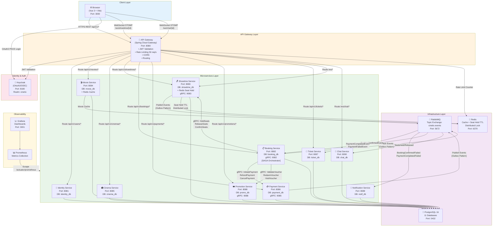
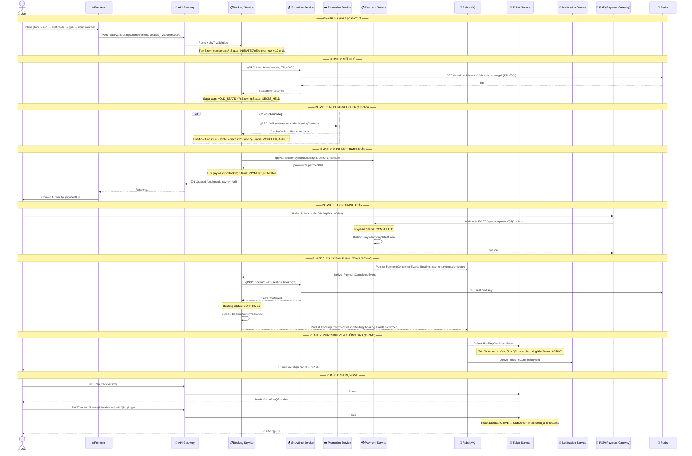
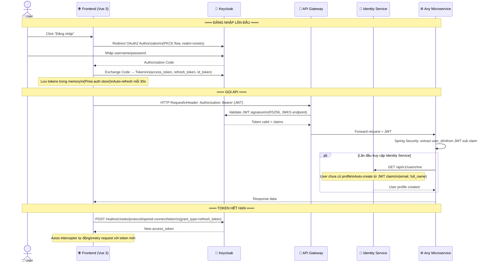
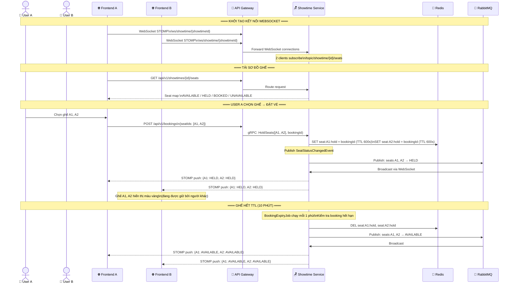
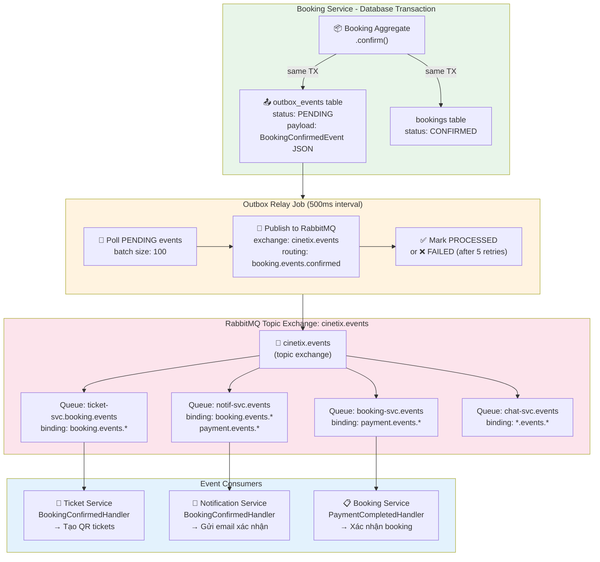
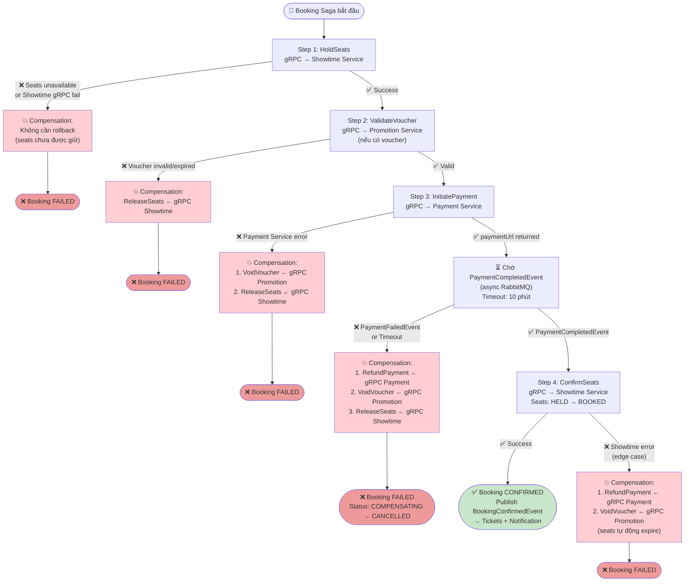
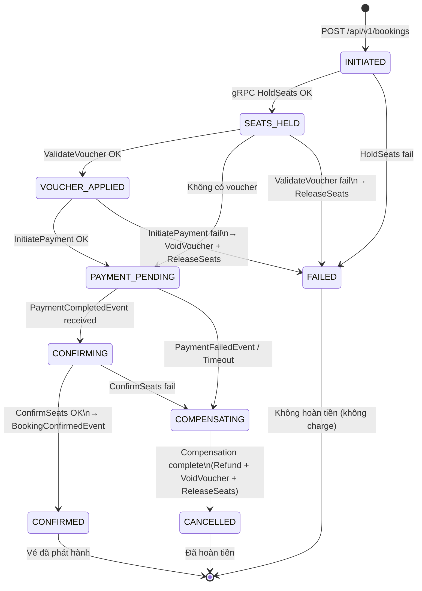
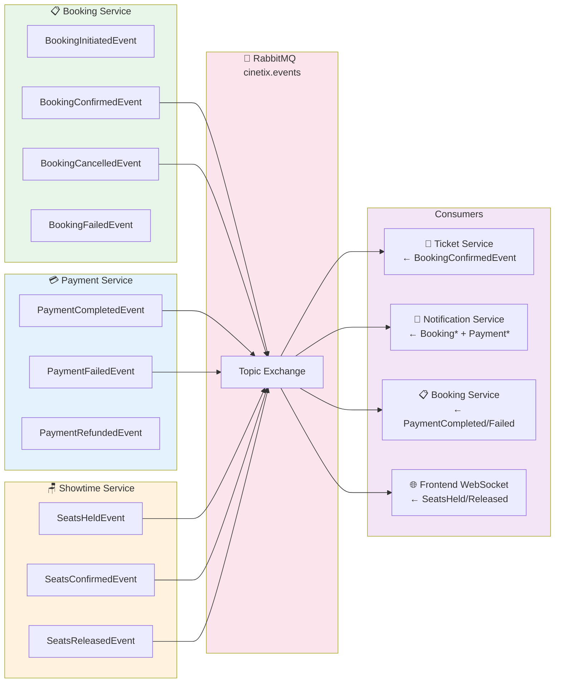

# CineTix — Online Movie Ticketing Platform

> Nền tảng đặt vé xem phim trực tuyến theo kiến trúc Microservices, tương tự CGV/Galaxy/BHD.  
> Cho phép người dùng duyệt phim, chọn rạp, chọn ghế real-time, thanh toán, nhận vé QR và chat với support.

---

## Mục lục

- [Tổng quan](#tổng-quan)
- [Tech Stack](#tech-stack)
- [Kiến trúc hệ thống](#kiến-trúc-hệ-thống)
- [Danh sách Microservices](#danh-sách-microservices)
- [Luồng hệ thống chi tiết](#luồng-hệ-thống-chi-tiết)
  - [Luồng đặt vé (Booking Saga)](#luồng-đặt-vé-booking-saga)
  - [Luồng xác thực (Auth Flow)](#luồng-xác-thực-auth-flow)
  - [Luồng real-time chọn ghế](#luồng-real-time-chọn-ghế)
  - [Luồng Event-Driven (Outbox → RabbitMQ)](#luồng-event-driven-outbox--rabbitmq)
  - [Luồng bù trừ lỗi (Compensation Flow)](#luồng-bù-trừ-lỗi-compensation-flow)
- [Cơ sở dữ liệu](#cơ-sở-dữ-liệu)
- [API Endpoints](#api-endpoints)
- [Cài đặt & Chạy local](#cài-đặt--chạy-local)
- [Biến môi trường](#biến-môi-trường)
- [Cấu trúc thư mục](#cấu-trúc-thư-mục)

---

## Tổng quan

**CineTix** là hệ thống đặt vé xem phim online end-to-end được xây dựng theo kiến trúc **Microservices** với **11 services** độc lập. Hệ thống áp dụng các pattern hiện đại:

| Pattern | Áp dụng tại |
|---------|------------|
| **Saga Orchestration** | Booking flow (hold seats → payment → confirm) |
| **Transactional Outbox** | Đảm bảo event publishing durability |
| **CQRS** | Booking Service (write model tách read model) |
| **Database per Service** | Mỗi service có PostgreSQL riêng |
| **Circuit Breaker + Retry** | gRPC calls tới Showtime, Payment |
| **Distributed Lock (Redis)** | Seat hold với TTL 10 phút |
| **DDD Tactical Patterns** | Aggregate, Entity, Value Object, Domain Event |

---

## Tech Stack

### Backend
| Layer | Technology |
|-------|-----------|
| Language | Java 21 |
| Framework | Spring Boot 3.3.4, Spring Cloud 2023.0.3 |
| Build | Maven 3 |
| Sync IPC | gRPC (grpc-spring-boot-starter) |
| Async IPC | RabbitMQ 3.13 (topic exchange) |
| API Gateway | Spring Cloud Gateway (REST/HTTP) |
| Real-time | WebSocket STOMP over SockJS |

### Data
| Layer | Technology |
|-------|-----------|
| Database | PostgreSQL 16 (database-per-service) |
| Cache / Lock | Redis 7 |
| Migration | Flyway |
| Resilience | Resilience4j (Circuit Breaker, Retry, Bulkhead) |

### Security
| Component | Technology |
|-----------|-----------|
| Identity Provider | Keycloak 25 (OAuth2 / OIDC) |
| Token | JWT RS256 |
| Service Auth | Spring Security Resource Server |

### Frontend
| Layer | Technology |
|-------|-----------|
| Framework | Vue 3 + Vite |
| State | Pinia |
| HTTP | Axios + JWT interceptor |
| Auth | keycloak-js |
| Styles | Tailwind CSS |
| Real-time | STOMP client (WebSocket) |

### Infrastructure
| Component | Technology |
|-----------|-----------|
| Containers | Docker + Docker Compose |
| Orchestration | Kubernetes + Helm |
| GitOps | ArgoCD |
| Monitoring | Prometheus + Grafana |
| Ingress | NGINX Ingress Controller |

---

## Kiến trúc hệ thống



---

## Danh sách Microservices

| Service | Port REST | Port gRPC | Database | Vai trò |
|---------|-----------|-----------|----------|---------|
| **api-gateway** | 8080 | — | Redis | Định tuyến, Rate Limit, JWT validate |
| **identity-service** | 8081 | — | identity_db | Hồ sơ người dùng, sync từ Keycloak JWT |
| **movie-service** | 8084 | — | movie_db | Danh mục phim, Redis cache |
| **cinema-service** | 8085 | — | cinema_db | Rạp, phòng chiếu, sơ đồ ghế |
| **showtime-service** | 8083 | 9083 | showtime_db | Suất chiếu, seat hold Redis, WebSocket |
| **booking-service** | 8082 | 9082 | booking_db | **Saga Orchestrator**, CQRS, Outbox |
| **payment-service** | 8086 | 9086 | payment_db | Thanh toán, refund, PSP webhook |
| **promotion-service** | 8088 | 9088 | promo_db | Khuyến mãi, voucher, mã giảm giá |
| **ticket-service** | 8087 | — | ticket_db | Tạo vé QR, validate tại rạp |
| **notification-service** | 8089 | — | notif_db | Email xác nhận đặt vé, receipt |
| **chat-service** | 8099 | — | chat_db | Chat real-time khách hàng & support |

---

## Luồng hệ thống chi tiết

### Luồng đặt vé (Booking Saga)

> Đây là luồng phức tạp nhất, áp dụng **Saga Orchestration Pattern** với cơ chế compensation đầy đủ.



---

### Luồng xác thực (Auth Flow)



---

### Luồng real-time chọn ghế



---

### Luồng Event-Driven (Outbox → RabbitMQ)



---

### Luồng bù trừ lỗi (Compensation Flow)



---

## Cơ sở dữ liệu

### Sơ đồ quan hệ tổng thể

```mermaid
erDiagram
    %% Identity
    USER_PROFILES {
        uuid id PK
        string email
        string full_name
        string phone
        string avatar_url
        string status
        timestamp created_at
    }

    %% Movie Service
    MOVIES {
        uuid id PK
        string title
        string original_title
        int duration_minutes
        decimal imdb_score
        string status "COMING_SOON|NOW_SHOWING|ENDED"
        date release_date
        string poster_url
    }
    MOVIE_GENRES {
        uuid movie_id FK
        string genre
    }
    MOVIES ||--o{ MOVIE_GENRES : has

    %% Cinema Service
    CINEMAS {
        uuid id PK
        string name
        string address
        string city
        string district
        decimal latitude
        decimal longitude
    }
    SCREENS {
        uuid id PK
        uuid cinema_id FK
        string name
        string type "STANDARD|IMAX|4DX|SCREENX"
        int total_seats
    }
    SEATS {
        uuid id PK
        uuid screen_id FK
        string seat_code
        int row_num
        int col_num
        string category "STANDARD|VIP|COUPLE"
    }
    CINEMAS ||--o{ SCREENS : has
    SCREENS ||--o{ SEATS : has

    %% Showtime Service
    SHOWTIMES {
        uuid id PK
        uuid movie_id
        uuid cinema_id
        uuid screen_id
        timestamp start_time
        timestamp end_time
        string status "SCHEDULED|ON_SALE|FULL|CANCELLED"
        decimal base_price
        decimal vip_price
        int available_seats
        int version
    }
    SEAT_STATUS {
        uuid id PK
        uuid showtime_id FK
        uuid seat_id
        string seat_code
        string status "AVAILABLE|HELD|BOOKED|UNAVAILABLE"
        uuid booking_id
    }
    SHOWTIMES ||--o{ SEAT_STATUS : tracks

    %% Booking Service
    BOOKINGS {
        uuid id PK
        uuid customer_id
        uuid showtime_id
        string status "INITIATED|SEATS_HELD|PAYMENT_PENDING|CONFIRMED|CANCELLED|FAILED"
        decimal subtotal
        decimal discount_amount
        decimal final_amount
        string voucher_code
        uuid payment_id
        timestamp expires_at
        int version
    }
    BOOKING_ITEMS {
        uuid id PK
        uuid booking_id FK
        uuid seat_id
        string seat_code
        string seat_category
        decimal unit_price
    }
    SAGA_STATES {
        uuid booking_id PK
        string current_step
        jsonb step_history
        timestamp started_at
    }
    BOOKINGS ||--o{ BOOKING_ITEMS : contains
    BOOKINGS ||--|| SAGA_STATES : tracks

    %% Payment Service
    PAYMENTS {
        uuid id PK
        uuid booking_id
        uuid customer_id
        decimal amount
        string status "PENDING|COMPLETED|FAILED|REFUNDED"
        string method
        string payment_url
        string idempotency_key
        timestamp expires_at
    }
    REFUNDS {
        uuid id PK
        uuid payment_id FK
        decimal amount
        string status
        string reason
    }
    PAYMENTS ||--o{ REFUNDS : has

    %% Promotion Service
    PROMOTIONS {
        uuid id PK
        string name
        string discount_type "PERCENT|FIXED"
        decimal discount_percent
        decimal discount_amount
        decimal max_discount
        int max_uses
        int current_uses
        boolean active
    }
    VOUCHERS {
        uuid id PK
        string code UK
        uuid promotion_id FK
        string status "ACTIVE|REDEEMED|EXPIRED|VOIDED"
        uuid assigned_customer_id
        uuid booking_id
        timestamp expires_at
    }
    PROMOTIONS ||--o{ VOUCHERS : generates

    %% Ticket Service
    TICKETS {
        uuid id PK
        uuid booking_id
        uuid customer_id
        string seat_code
        uuid showtime_id
        string movie_title
        string cinema_name
        string qr_code
        string status "ACTIVE|USED|CANCELLED|EXPIRED"
        timestamp issued_at
        timestamp used_at
    }
```



---

## API Endpoints

### API Gateway — `http://localhost:8080`

#### Booking Service — `/api/v1/bookings`
| Method | Endpoint | Mô tả | Auth |
|--------|----------|-------|------|
| `POST` | `/` | Tạo booking mới (trả về paymentUrl) | ✅ USER |
| `GET` | `/{bookingId}` | Lấy chi tiết booking | ✅ USER (own) |
| `GET` | `/my` | Danh sách booking của tôi (paginated) | ✅ USER |
| `DELETE` | `/{bookingId}` | Huỷ booking | ✅ USER |

#### Movie Service — `/api/v1/movies`
| Method | Endpoint | Mô tả | Auth |
|--------|----------|-------|------|
| `GET` | `/` | Danh sách phim đang chiếu (cached) | ❌ Public |
| `GET` | `/coming-soon` | Phim sắp chiếu | ❌ Public |
| `GET` | `/{id}` | Chi tiết phim (cached) | ❌ Public |
| `GET` | `/search?q=` | Tìm kiếm theo tên | ❌ Public |
| `POST` | `/` | Thêm phim mới | ✅ ADMIN |
| `PUT` | `/{id}` | Cập nhật phim | ✅ ADMIN |

#### Showtime Service — `/api/v1/showtimes`
| Method | Endpoint | Mô tả | Auth |
|--------|----------|-------|------|
| `GET` | `/` | Danh sách suất chiếu đang bán | ❌ Public |
| `GET` | `/{id}` | Chi tiết suất chiếu | ❌ Public |
| `GET` | `/{id}/seats` | Sơ đồ ghế + trạng thái | ✅ USER |
| `POST` | `/` | Tạo suất chiếu | ✅ ADMIN |
| `PATCH` | `/{id}/open-for-sale` | Mở bán vé | ✅ ADMIN |
| WS | `/ws/showtime/{id}` | Real-time seat updates (STOMP) | ✅ USER |

#### Cinema Service — `/api/v1/cinemas`
| Method | Endpoint | Mô tả | Auth |
|--------|----------|-------|------|
| `GET` | `/` | Danh sách rạp (filter by city) | ❌ Public |
| `GET` | `/{id}` | Chi tiết rạp | ❌ Public |
| `GET` | `/{id}/screens` | Danh sách phòng chiếu | ❌ Public |
| `POST` | `/` | Thêm rạp | ✅ ADMIN |
| `POST` | `/{id}/screens` | Thêm phòng chiếu | ✅ ADMIN |

#### Ticket Service — `/api/v1/tickets`
| Method | Endpoint | Mô tả | Auth |
|--------|----------|-------|------|
| `GET` | `/booking/{bookingId}` | Vé theo booking | ✅ USER |
| `GET` | `/my` | Tất cả vé của tôi | ✅ USER |
| `POST` | `/{id}/validate` | Xác thực vé tại cổng rạp | ✅ ADMIN |

#### Payment Service — `/api/v1/payments`
| Method | Endpoint | Mô tả | Auth |
|--------|----------|-------|------|
| `GET` | `/{id}` | Chi tiết thanh toán | ✅ USER |
| `GET` | `/booking/{bookingId}` | Thanh toán theo booking | ✅ USER |
| `POST` | `/{id}/confirm` | PSP Webhook: xác nhận thành công | 🔑 PSP Secret |
| `POST` | `/{id}/fail` | PSP Webhook: báo thất bại | 🔑 PSP Secret |

#### Promotion Service — `/api/v1/promotions`
| Method | Endpoint | Mô tả | Auth |
|--------|----------|-------|------|
| `GET` | `/` | Danh sách khuyến mãi đang hoạt động | ❌ Public |
| `POST` | `/` | Tạo chương trình KM | ✅ ADMIN |
| `POST` | `/vouchers` | Tạo voucher codes | ✅ ADMIN |

---

## Cài đặt & Chạy local

### Yêu cầu
- Docker & Docker Compose v2+
- Java 21 (nếu build từ source)
- Node.js 20+ (cho frontend dev)
- Maven 3.9+

### Khởi động toàn bộ hệ thống với Docker Compose

```bash
# Clone repository
git clone <repo-url>
cd CinemaCinema

# Khởi động infrastructure (PostgreSQL, Redis, RabbitMQ, Keycloak)
docker compose -f infrastructure/docker/docker-compose.yml up -d postgres redis rabbitmq keycloak

# Chờ Keycloak khởi động (~60s), sau đó import realm config
# (Nếu có file realm-export.json)
# docker exec keycloak /opt/keycloak/bin/kc.sh import --file /realm-export.json

# Build và khởi động tất cả services
docker compose -f infrastructure/docker/docker-compose.yml up -d

# Kiểm tra logs
docker compose -f infrastructure/docker/docker-compose.yml logs -f booking-service
```

### Chạy frontend dev mode

```bash
cd frontend
npm install
npm run dev
# → http://localhost:3000
```

### Chạy từng service (development)

```bash
# Build tất cả modules
./mvnw clean install -DskipTests

# Chạy service cụ thể
cd services/booking-service
./mvnw spring-boot:run -Dspring.profiles.active=local
```

### Truy cập services

| Service | URL |
|---------|-----|
| Frontend | http://localhost:3000 |
| API Gateway | http://localhost:8080 |
| Keycloak Admin | http://localhost:8180 (admin/admin) |
| RabbitMQ Management | http://localhost:15672 (cinetix/cinetix_secret) |
| Grafana | http://localhost:3001 |
| Prometheus | http://localhost:9090 |

---

## Biến môi trường

### Backend Services (Docker Compose)

```env
# Database
DB_HOST=postgres
DB_PORT=5432
DB_USER=postgres
DB_PASS=postgres

# Redis
REDIS_HOST=redis
REDIS_PASSWORD=redis_secret
REDIS_PORT=6379

# RabbitMQ
RABBITMQ_HOST=rabbitmq
RABBITMQ_PORT=5672
RABBITMQ_USER=cinetix
RABBITMQ_PASS=cinetix_secret

# Keycloak
KEYCLOAK_URL=http://keycloak:8180
KEYCLOAK_REALM=cinetix
KEYCLOAK_CLIENT_ID=cinetix-backend

# Email (Notification Service)
MAIL_HOST=smtp.gmail.com
MAIL_PORT=587
MAIL_USERNAME=your-email@gmail.com
MAIL_PASSWORD=your-app-password
```

### Frontend

```env
VITE_KEYCLOAK_URL=http://localhost:8180
VITE_KEYCLOAK_REALM=cinetix
VITE_KEYCLOAK_CLIENT=cinetix-frontend
VITE_API_BASE=/api/v1
```

---

## Cấu trúc thư mục

```
CinemaCinema/
├── frontend/                   # Vue 3 + Vite SPA
│   └── src/
│       ├── pages/              # Trang: Home, MovieDetail, SeatSelection...
│       ├── components/         # UI components
│       ├── stores/             # Pinia: auth, booking
│       ├── api/                # Axios clients per service
│       ├── composables/        # useSeatMap.js, ...
│       └── router/             # Vue Router
│
├── services/                   # 11 Microservices (Spring Boot)
│   ├── api-gateway/
│   ├── identity-service/
│   ├── movie-service/
│   ├── cinema-service/
│   ├── showtime-service/
│   ├── booking-service/        # ← Core: Saga Orchestrator
│   ├── payment-service/
│   ├── promotion-service/
│   ├── ticket-service/
│   ├── notification-service/
│   └── chat-service/
│
├── libs/                       # Shared Libraries
│   ├── cinetix-common/         # ApiResponse, DDD base classes, exceptions
│   ├── cinetix-security/       # JWT / Spring Security config
│   ├── cinetix-outbox/         # Outbox pattern implementation
│   └── cinetix-grpc-stubs/     # Generated gRPC stubs
│
├── proto/                      # Protobuf definitions (.proto files)
│   ├── showtime.proto
│   ├── payment.proto
│   └── promotion.proto
│
├── infrastructure/
│   ├── docker/
│   │   └── docker-compose.yml  # Local dev environment
│   ├── helm/                   # Kubernetes Helm charts
│   │   ├── charts/             # Chart per service
│   │   └── values/             # Environment-specific values
│   └── argocd/                 # GitOps ArgoCD apps
│
└── pom.xml                     # Maven parent POM
```

---

## Luồng trạng thái Booking



---

## Kiến trúc Domain Events



---

*CineTix — Built with ❤️ using Java 21, Spring Boot 3, Vue 3, and modern cloud-native patterns.*
